# Scurvee.com

GitHub: https://github.com/PaichienFeng/scurvee_com

Heroku URL: https://scurvee-com-66ca99bee111.herokuapp.com/

Login data:
manager ->
Email: ilcapo@gmail.com
Password: password12345

team member ->
Email: john@example.com
Password: securepass

## Table of Contents:
### - [Description](#description)
### - [Usage](#usage)
### - [License](#license)
### - [Contributing](#contributing)
### - [Questions](#questions)
<br><br>

## Description
```md
AS A Project Manager, I would like a time managenment application where I can monitor the planned and actual time spent on a particular task for a particular project.
I WANT to be able to assign my team a scheduled task and duration to be spent on a task for a specific project
SO THAT My team can retrieve the scheduled task and enter the actual time spent on individual project task.
```

## Usage
```md
GIVEN a single-page time tracker application
THEN I am presented with a login page to enter my Email and Password.  The Footer is a Scurvee.com logo.
WHEN I click on the Login button
THEN I am taken to the member Home Page
```
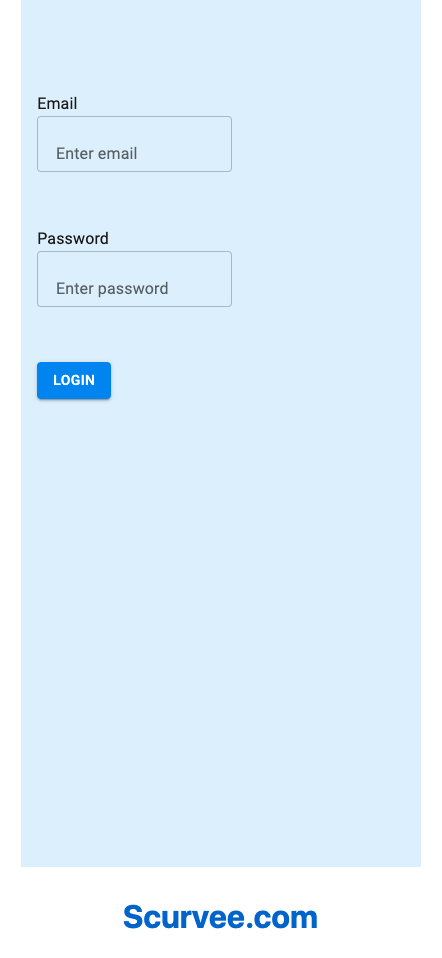

```md
GIVEN I am in the member Home Page
THEN I am presented with with member name, current date and member avatar as the header.  The content is made up of 2 bar charts, one indicating planned task(s) for project(s) and the other the actual time spent on task(s) for particular project(s).  The footer is a Scurvee.com logo.
WHEN I click on the Logout button
THEN I am taken to the Login Page
WHEN I click on the Add button
THEN I am taken to the member Team Task Page
```
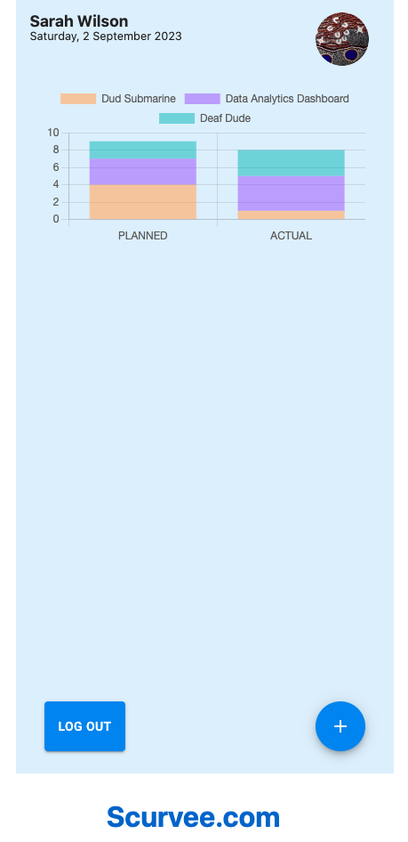

```md
GIVEN I am in the member Team Task Page
THEN I am presented with member name, current date and member avatar as the header.  The content is made up of 3 input boxes for a date on when the task had been undertaken, a drop down menu to choose which particular project the task is associated with and the total duration of the task on the date indicated.  The footer is a Scurvee.com logo.
WHEN I click on the Save button
THEN I am taken to the member Home Page and the actual graph updated accordingly
WHEN I click on the Cancel button
THEN I am taken to the member Home Page
```
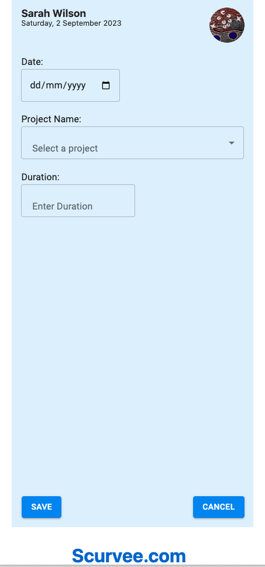

```md
GIVEN I am in the Project Manager Home Page
THEN I am presented with with Project Manager name, current date and Project Manager avatar as the header.  The content is made up of 2 bar charts, one indicating planned task(s) for project(s) and the other the actual time spent on task(s) for particular project(s).  The footer is a navigation icons for Home, Team List and Project List.
WHEN I click on the Logout button
THEN I am taken to the Login Page
WHEN I click on the Add button
THEN I am taken to the Project Manager Task Page
WHEN I click on the Home Icon
THEN I am taken to the Home Page
WHEN I click on the TeamLIst
THEN I am taken to the member Team List Page
WHEN I click on the ProjectLIst
THEN I am taken to the member Project List Page
```
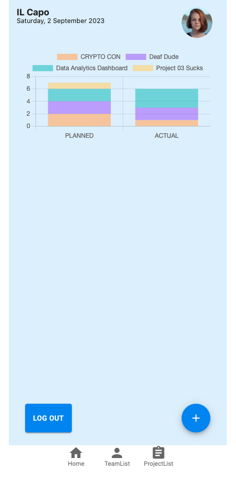

```md
GIVEN I am in the Project Manager Task Page
THEN I am presented with Project Manager name, current date and Project Manager avatar as the header.  The content is made up of 3 input boxes for a date on when the task had been undertaken, a drop down menu to choose which particular project the task is associated with and the total duration of the task on the date indicated.  The footer is a navigation icons for Home, Team List and Project List.
WHEN I click on the Save button
THEN I am taken to the Project Manager Home Page and the actual graph updated accordingly
WHEN I click on the Cancel button
THEN I am taken to the Project Manager Home Page
WHEN I click on the Home Icon
THEN I am taken to the Home Page
WHEN I click on the TeamLIst
THEN I am taken to the member Team List Page
WHEN I click on the ProjectLIst
THEN I am taken to the member Project List Page
```
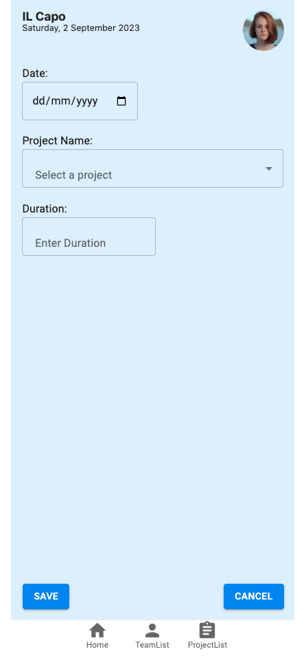

```md
GIVEN I am in the Project Manager Team List Page
THEN I am presented with Project Manager name, current date and Project Manager avatar as the header.  The content is made up of member cards comprising member Avatar, member name, member title and a Delete Icon
WHEN I click on the Delete Icon
THEN the member will be deleted from the team member database
WHEN I click on the Add Icon
THEN I am taken to the Add Team Member Page
WHEN I click on the Home Icon
THEN I am taken to the Home Page
WHEN I click on the TeamLIst
THEN I am taken to the member Team List Page
WHEN I click on the ProjectLIst
THEN I am taken to the member Project List Page
```
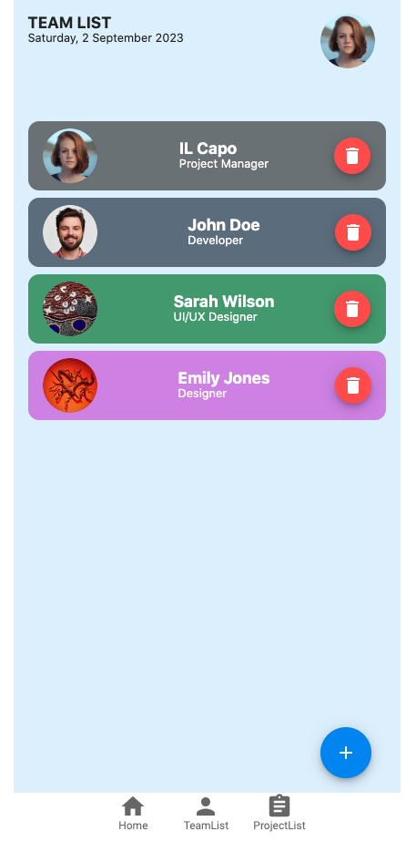

```md
GIVEN I am in the Project Manager Add Team Member Page
THEN I am presented with Project Manager name, current date and Project Manager avatar as the header.  The content is made up of form inputs for Username, Title, Email, Assigned Password, Rate $/Hr, background color picker and Avatar Image Link
WHEN I click on the Add Button
THEN I am taken to the Team List Page and the data saved in team member database
WHEN I click on the Cancel Button
THEN I am taken back to the Team List Page
WHEN I click on the Home Icon
THEN I am taken to the Home Page
WHEN I click on the TeamLIst
THEN I am taken to the member Team List Page
WHEN I click on the ProjectLIst
THEN I am taken to the member Project List Page
```
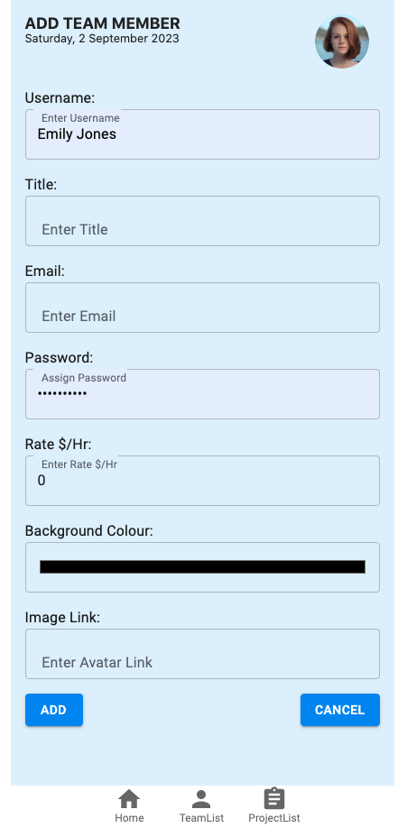

```md
GIVEN I am in the Project Manager Team List Page
THEN I am presented with Project Manager name, current date and Project Manager avatar as the header.  The content is made up of project cards comprising client logo or Avatar, client organisation name and and brief job scope description
WHEN I click on the Project Card(s)
THEN I am taken to the particular Project Detail Page
WHEN I click on the Add Icon
THEN I am taken to the Add Project Page
WHEN I click on the Home Icon
THEN I am taken to the Home Page
WHEN I click on the TeamLIst
THEN I am taken to the member Team List Page
WHEN I click on the ProjectLIst
THEN I am taken to the member Project List Page
```
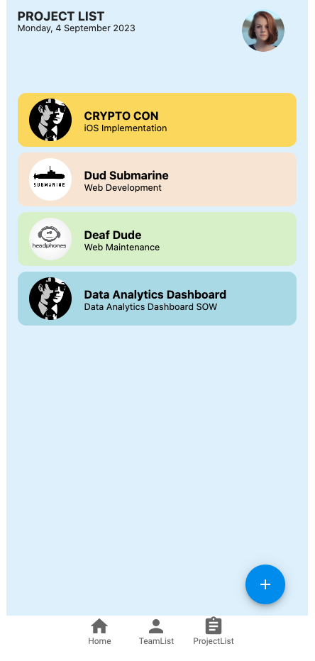

```md
GIVEN I am in the Project Manager Add Project Page
THEN I am presented with Project Manager name, current date and Project Manager avatar as the header.  The content is made up of form inputs for project name, client name, total budget, logo/Avatar Image Link, brief job scope description, full scope of works and background color picker
WHEN I click on the Add Button
THEN I am taken to the Project List Page and the data saved in project database
WHEN I click on the Cancel Button
THEN I am taken back to the Project List Page
WHEN I click on the Home Icon
THEN I am taken to the Home Page
WHEN I click on the TeamLIst
THEN I am taken to the member Team List Page
WHEN I click on the ProjectLIst
THEN I am taken to the member Project List Page
```
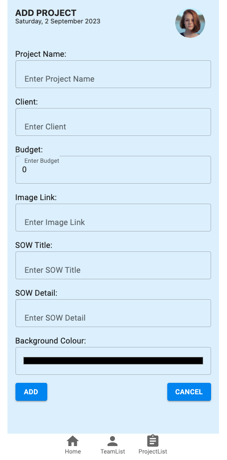

```md
GIVEN I am in the Project Manager Project Detail Page
THEN I am presented with Project Manager name, current date and Project Manager avatar as the header.  The content is made up of the particular project detail card consistying of client logo/avatar, insights icon (for future s-curve link), project name, project value, brief job scope description and full scope of works.  This is followed by assigned team members cards consisting of member avatar, member name and member title.
WHEN I click on the Member Card
THEN I am taken to the Team Assignment Page
WHEN I click on the Add Button
THEN I am taken to the Add Project Team Page
WHEN I click on the Home Icon
THEN I am taken to the Home Page
WHEN I click on the TeamLIst
THEN I am taken to the member Team List Page
WHEN I click on the ProjectLIst
THEN I am taken to the member Project List Page
```
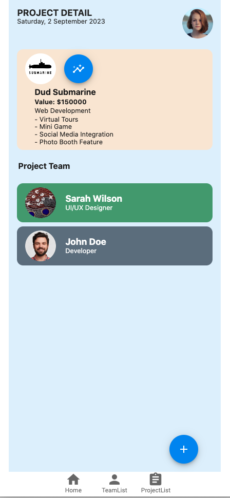

```md
GIVEN I am in the Project Manager Team Assignment Page
THEN I am presented with Project Manager name, current date and Project Manager avatar as the header.  The content is made up of the particular project detail card consisting of project name and brief job scope description.  This is followed by the team member card consisting of member avatar, member name and member title. Next section will be form input for a date picker, task description and anticipated task duration.
WHEN I click on the Add Button
THEN I am taken to the Project Detail Page and the task date and task duration information used to construct the planned bar chart section for that particular project.
WHEN I click on the Cancel Button
THEN I am taken back to the Project Detail Page
WHEN I click on the Home Icon
THEN I am taken to the Home Page
WHEN I click on the TeamLIst
THEN I am taken to the member Team List Page
WHEN I click on the ProjectLIst
THEN I am taken to the member Project List Page
```
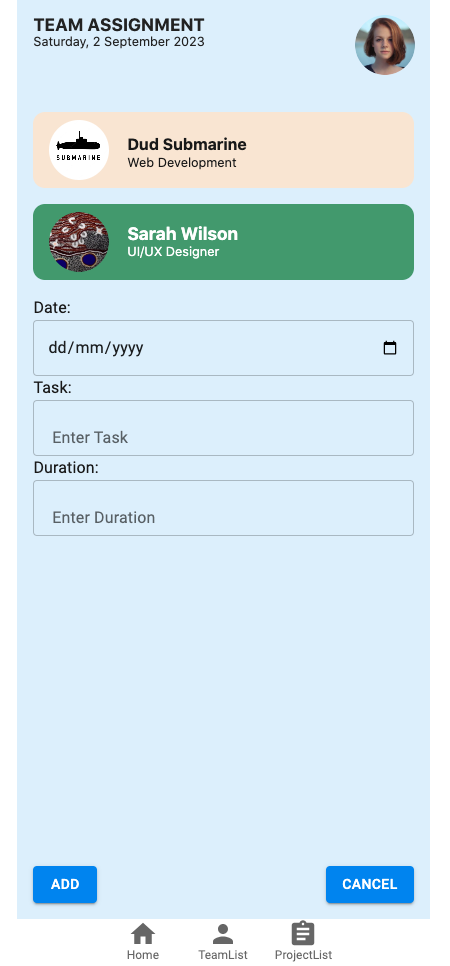

```md
GIVEN I am in the Project Manager Add Project Team Page
THEN I am presented with Project Manager name, current date and Project Manager avatar as the header.  The content is made up of available team member cards consisting of member avatar, member name and member title.
WHEN I click on the Member Card
THEN I am taken to the Project Detail Page with the new member card added onto the project team
WHEN I click on the Cancel Button
THEN I am taken back to the Project Detail Page
WHEN I click on the Home Icon
THEN I am taken to the Home Page
WHEN I click on the TeamLIst
THEN I am taken to the member Team List Page
WHEN I click on the ProjectLIst
THEN I am taken to the member Project List Page
```
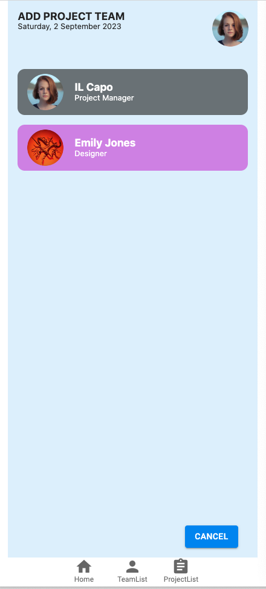


## License
- MIT

## Contributing
Thank you for investing your time in contributing to my Portfolio!<br><br>
In this guide you will get an overview of the contribution workflow from creating a pull request, reviewing and merging the pull request.<br><br>
<b>Making the changes locally</b><br>
1. Fork the repository<br>
2. Install or update Node.js 8.2.4<br>
3. Create a working branch and start with your changes!<br><br>
<b>Commit your update</b><br>
Commit the changes once you are happy with them.  Don't forget to self-review to speed up the review process.<br><br>
<b>Pull Request</b><br>
When you are finished with the changes, create a pull request<br><br>
<b>Merging your Pull Request</b><br>
1. Our team will review your Pull Request.<br>
2. We may ask for changes to be made before your Pull Request can be merged.<br>
3. You can apply suggested changes directly through the UI.  You can make any other changes on your fork, then commit them on your branch.<br>
4. As you update your PR and apply changes, mark each conversation as resolved.<br>
5. You can then merge your contributions.<br><br>
Thank you for your contribution.<br><br>

## Questions
If you have any questions, please contact us:
- GitHub: [peterwonghg](https://github.com/peterwonghg)
- GitHub: [PaichienFeng](https://github.com/PaichienFeng)

<br><br>
